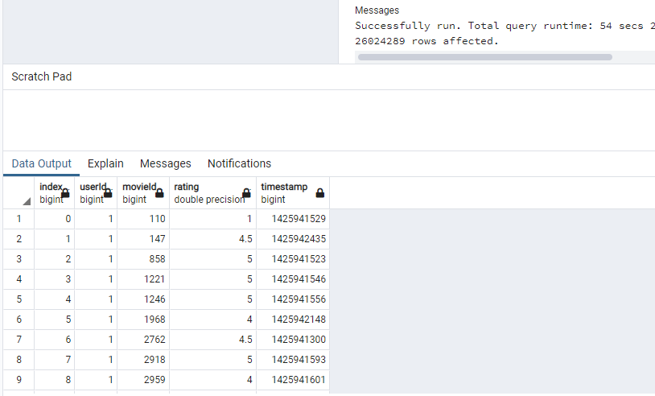
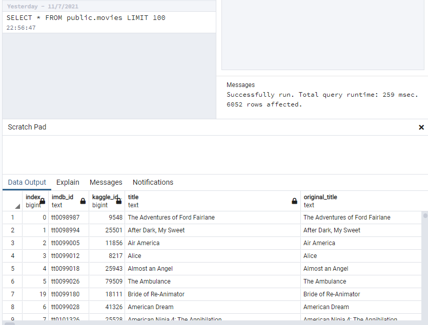

# Movies-ETL

## Background
Amazing Prime loves the dataset and wants to keep it updated on a daily basis. Britta needs your help to create an automated pipeline that takes in new data, performs the appropriate transformations, and loads the data into existing tables. You’ll need to refactor the code from this module to create one function that takes in the three files—Wikipedia data, Kaggle metadata, and the MovieLens rating data—and performs the ETL process by adding the data to a PostgreSQL database.

### Data
Data was used from wikipedia, movie lens, and kaggle.
These were very large data sets.
This information was cleaned and merged on columns and other information was dropped.
I ran a code to import this into a database and received the following results.

#### Ratings 26,024,289
 

#### Movies 6052 rows
 

### Challenges
I had issues with file location, dropping unecessary code, and even an error after importing data.
